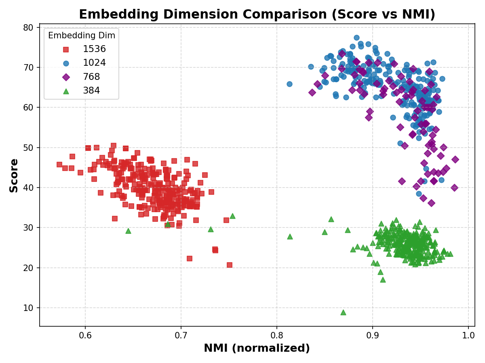

## Embedding Dimension Analysis

The goal of this analysis is to understand how different vector dimensions influence the balance between **clustering accuracy**, **online stability**, and **processing efficiency**. Such a study is crucial because the choice of dimensionality directly affects both **semantic expressiveness** and **system scalability** in real-time publish/subscribe scenarios. We systematically compared **384, 768, 1024, and 1536 dimensions** on the **TSet Dataset**. This dataset was chosen because it is representative of short-text streams, where semantic boundaries are often subtle and dimensionality plays a significant role.

---

## Evaluation Metric

To jointly evaluate clustering quality, online matching stability, and runtime efficiency, we define a **composite score function**:

$$
\text{Score} = \text{NMI} \times \text{FMR} \times (1 - \text{NormTime})
$$

where:
- **NMI** (Normalized Mutual Information): Measures agreement with ground-truth topics. A higher value indicates better clustering accuracy.
- **FMR (FastMatchRate)**: The probability that a document is directly assigned to an existing topic *during streaming*, without needing a second round of processing. A higher FMR reflects stronger online stability and reduced overhead.
- **NormTime**: Processing time normalized to the range \([0,1]\). Lower values indicate better efficiency; we use $$\(1 - \text{NormTime}\)$$ so that faster systems contribute positively to the score.

This formulation ensures that no single factor dominates. Instead, it captures the **three key dimensions** that matter in our streaming system:
1. **Accuracy (NMI)**: Do embeddings help separate topics correctly?
2. **Stability (FMR)**: Do embeddings allow real-time assignment without reprocessing?
3. **Efficiency (NormTime)**: Do embeddings support low-latency operation at scale?

---

## Experimental Results

Recognizing that **different embedding dimensions may favor different hyperparameter settings**, we performed **grid search** for each dimensionality. Rather than selecting only the single best configuration, we present **multiple promising configurations** from the search results. This provides a more comprehensive view of how each dimensionality behaves under reasonable parameter choices, avoiding bias from focusing only on the absolute best run.

The results are summarized in the following figure:

   

*Figure: Composite score vs. NMI for different embedding dimensions. Each dimension is represented by **multiple points**, corresponding to different hyperparameter settings identified during grid search.*

### Observations

- **384 / 768 dimensions**: These embeddings compress semantic information too aggressively. As a result, topic boundaries become blurred and NMI drops. The **FMR** also decreases significantly, meaning that many documents fail to find their topic on the first attempt and require reprocessing.
  
- **1536 dimensions**: While higher-dimensional vectors provide slightly richer representations, they also suffer from the **curse of dimensionality**. Distance metrics become less discriminative, leading to unstable topic assignments and fragmented clusters. Moreover, computational cost increases substantially, reflected in larger normalized runtime values.

- **768 vs. 1024 dimensions**: Both 768 and 1024 dimensions provide strong performance, with **1024** slightly outperforming **768**. While 768 dimensions offer good clustering accuracy (high **NMI**) and decent **FMR**, the **1024 dimensions** preserve better semantic granularity, achieving a more stable and efficient clustering process. The **FMR** for 1024 dimensions is also higher, meaning more documents are matched on the fly, reducing the need for reprocessing. In terms of **NMI** and **FMR**, 1024 dimensions maintain a more consistent and robust performance across various configurations, which is why we selected it as the default choice.

### Model Information for Each Dimension

- **1536 Dimensions**: The embedding model used is Qwen2 (https://huggingface.co/Alibaba-NLP/gte-Qwen2-1.5B-instruct).
- **1024 Dimensions**: The embedding model used is BGE_LARGE (https://huggingface.co/BAAI/bge-large-en-v1.5).
- **768 Dimensions**: The embedding model used is E5 (https://huggingface.co/intfloat/multilingual-e5-base).
- **384 Dimensions**: The embedding model used is BGE_SMALL (https://huggingface.co/BAAI/bge-small-en-v1.5).

---

## Key Insights

1. **Balance Between Quality and Efficiency**  
   Lower dimensions (384/768) run faster but compromise semantic resolution. Higher dimensions (1536) enrich semantics but introduce instability and inefficiency. **1024 dimensions consistently outperform other choices across a range of parameter settings**.

2. **The Role of FastMatchRate (FMR)**  
   Unlike conventional clustering metrics, **FMR** directly measures *streaming robustness*. A higher FMR means documents are more likely to be matched on the fly, reducing computational overhead. This metric highlights the **practical value** of embedding dimensionality in online systems, beyond static clustering accuracy.

3. **Comprehensive Comparison Through Grid Search**  
   By reporting **multiple promising configurations** for each dimension, we ensure that the results reflect the overall behavior of each setting, not just a cherry-picked best case. This provides a fairer and more transparent comparison.

4. **Justification of Default Choice**  
   Based on empirical evidence, we adopt **1024 dimensions** as the default configuration in DISPS. This choice is not arbitrary but supported by a broad set of experiments balancing **accuracy (NMI)**, **stability (FMR)**, and **efficiency (NormTime)**.

---

## Conclusion

This analysis demonstrates that embedding dimensionality has a **non-trivial impact** on both the quality and scalability of real-time publish/subscribe systems. Our results confirm that **1024-dimensional embeddings**, when considered across multiple parameter configurations, provide the most favorable balance, making them the best choice for DISPS. By sharing these results, we aim to increase transparency and reproducibility of our study. The **score function**, **grid search process**, and **raw experimental results** are available in this repository for further inspection.
